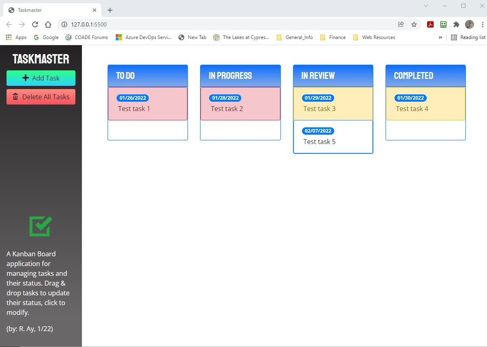

# Taskmaster
A Task Management Tool  
Richard Ay (August 2020, *updated January 2022*)

## Table of Contents
* [Application Walk Through](#application-walk-through)
* [Technologies Used](#technologies-used)
* [Deployment Link](#deployment-link)
* [Application Screen Shots](#application-screen-shots)

## Application Walk Through

This application allows the user to create tasks, and change their status (to do, in progress, in review, completed).  

**Adding Tasks:**
Tasks can be added by clicking on the "Add Task" button.  When a task is added, a "modal" opens to permit the definition of the task description as well as a "due date".  Dates are selected and maintained via the "JQuery UI Datepicker".  (Dates in the past cannot be selected.)

**Task Maintenance:**
The information related to tasks can be modified as necessary.  Clicking on the "task text" allows the test to be edited.  Clicking on the "task due date" brings up the Datepicker, allowing the selection of a new due date.  The status of a task can be changed by "dragging and dropping" the task to a new "status column".  During the "drag operation", the background of the "drop zones" is modified to show legal drop areas.  A "delete zone" also appears at the bottom of the window to allow the deleting of the selected task.  An "audit function" runs on a timer to update task backgrounds every half-hour.  The background of future tasks is white, the background of tasks due within two days is light yellow, and the background of tasks past due is red.  The complete set of (all) tasks can be deleted by clicking on the "Delete All Tasks" button.

**Responsiveness:**
The application is responsive to the device window.  The display of the various task zones will be adjusted based on the current window size.  
- for larger screens, the header area is to the left and the four status zones are aligned horizontally.
- for medium size screens, the header area is to the left and there are two rows of two status zones. 
- for smaller size screens, the header area moves to the top of the window and the status zones are arranged in a vertical column.

**Persistence**
All tasks (and associated information) is saved to local browser storage.  When the application is started, task information is retrieved from local storage and displayed in the browser window.  New tasks, and task modifications, are immediately saved to local browser storage.

## Technologies Used

* Bootstrap
* JQuery
* JQuery UI
* Moment.js
* Google fonts
* Iconic icons
* Local browser storage

## Deployment Link
The deployment link on GitHub is: https://CaptainRich.github.io/taskmaster-pro   
[GitHub](https://CaptainRich.github.io/taskmaster-pro) 

## Application Screen Shots

 Image of the application.
 Image of the application on medium width display.